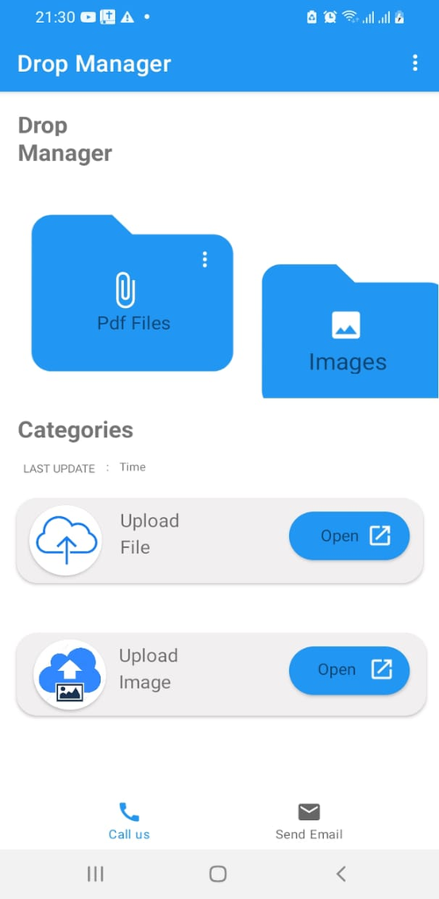
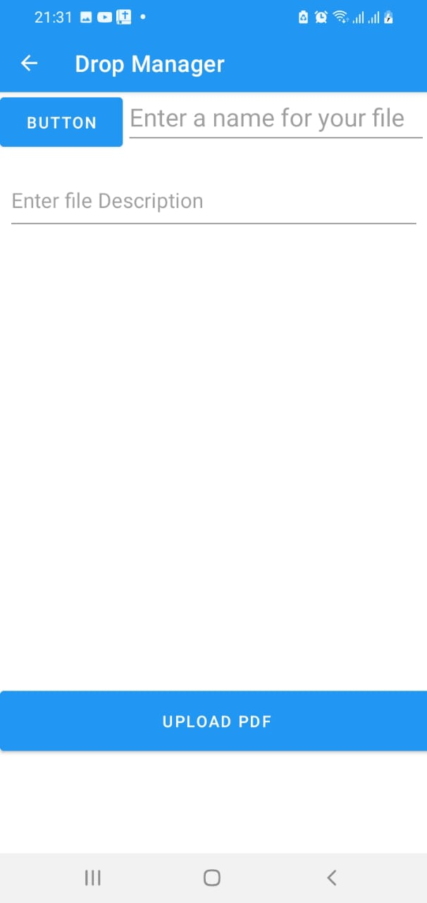
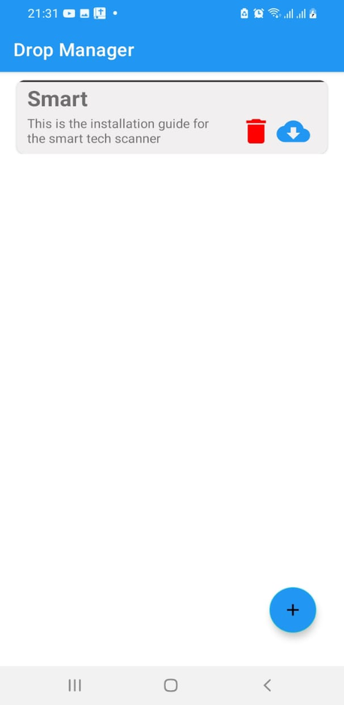

# SpaceX
This is a mobile App that displays a list of ships using the space X API

## Description
The application displays a list of ships and Details of each ship. It is also utilizing Room database to save the ship objects, displaying the list of saved ships. The user can also delete the ships they are not interested.
#### By **[JOSEPH MAINA](https://github.com/JOSEPHMAINA1995)** **[JOSEPH MAINA](https://github.com/JOSEPHMAINA1995)** **[JOSEPH MAINA](https://github.com/JOSEPHMAINA1995)**

## Prerequisite
* A complete Laptop or desktop machine installed any operating system of your choise
* Internet connection for stable working environment
* Android studio
* Emulator or an android mobile device
* JDK	

## Technologies Used
* Multi-Modular Application
* MVVM Architecture
* Kotlin
* Room Database
* Coroutines
* TDD

### License

MIT License
Permission is hereby granted, free of charge, to any person obtaining a copy
of this software and associated documentation files (the "Software"), to deal
in the Software without restriction, including without limitation the rights
to use, copy, modify, merge, publish, distribute, sublicense, and/or sell
copies of the Software, and to permit persons to whom the Software is
furnished to do so, subject to the following conditions:

The above copyright notice and this permission notice shall be included in all
copies or substantial portions of the Software.

THE SOFTWARE IS PROVIDED "AS IS", WITHOUT WARRANTY OF ANY KIND, EXPRESS OR
IMPLIED, INCLUDING BUT NOT LIMITED TO THE WARRANTIES OF MERCHANTABILITY,
FITNESS FOR A PARTICULAR PURPOSE AND NONINFRINGEMENT. IN NO EVENT SHALL THE
AUTHORS OR COPYRIGHT HOLDERS BE LIABLE FOR ANY CLAIM, DAMAGES OR OTHER
LIABILITY, WHETHER IN AN ACTION OF CONTRACT, TORT OR OTHERWISE, ARISING FROM,
OUT OF OR IN CONNECTION WITH THE SOFTWARE OR THE USE OR OTHER DEALINGS IN THE
SOFTWARE. 

Copyright (c) 2022 **[JOSEPH MAINA](https://github.com/JOSEPHMAINA1995)**
